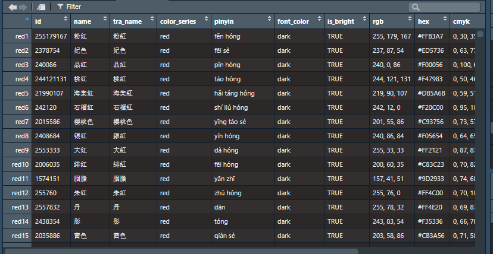

# 0609

- "colorRamp" is powerful which can auto order colors from cold to hot.
  - [【R>>RColorBrewer】神仙函数colorRampPalette - 简书 (jianshu.com)](https://www.jianshu.com/p/1ebeaaed6f4e)
  - RColorBrewer is similar

# 0608

- df create

- use ggsci + prismatic::color(pal_npg()(10))
  - [Scientific Journal and Sci-Fi Themed Color Palettes for ggplot2 • ggsci (nanx.me)](https://nanx.me/ggsci/articles/ggsci.html)
  - 

# 0607

data sorce:

- [GUSCSS/all_in_one.json at master · imoyao/GUSCSS · GitHub](https://github.com/imoyao/GUSCSS/blob/master/_data/all_in_one.json)
  - [GUSCSS/Traditional-Chinese-Colors-in.json at master · imoyao/GUSCSS · GitHub](https://github.com/imoyao/GUSCSS/blob/master/_data/Traditional-Chinese-Colors-in.json)

website:

- [Traditional-Chinese-Colors | 中国传统色 (masantu.com)](https://colors.masantu.com/#/?colorId=228207142)

- [鹅黄 - 中国传统颜色手册 | Chinese Color Cheatsheet (cnxiaobai.com)](https://colors.cnxiaobai.com/)
- [星蓝 - 中国色 - 中国传统颜色 (zhongguose.com)](http://zhongguose.com/#xinglan)

Ref:

- [EmilHvitfeldt/paletteer: 🎨🎨🎨 Collection of most color palettes in a single R package (github.com)](https://github.com/EmilHvitfeldt/paletteer)
- [Scientific Journal and Sci-Fi Themed Color Palettes for ggplot2 • ggsci (nanx.me)](https://nanx.me/ggsci/)

Develop Ref:

- [01. 使用各种开发工具开发我的第一个R 包 (yuque.com)](https://www.yuque.com/mugpeng/rr/ch456f#TbAlL)

